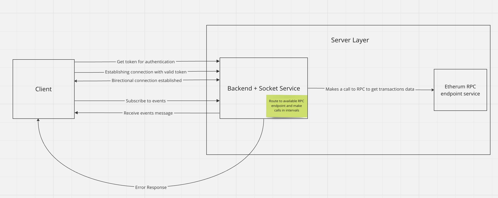

#### Ethereum-Tracker

> Track and analyze Ethereum blockchain transactions in real-time.

#### High Level Overview



#### Project Structure

Overall, the project is designed to be scalable, maintainable and extensible. The use of a modular monolithic architecture that can easily spin off to a micro-service that promotes code organization and separation of concerns.

#### Problem Statement

We want to track the activities on the block for our analysis application by streaming the transactions on the blockchain as they happen. We are interested in the following fields:

- Sender Address
- Receiver Address
- BlockNumber
- BlockHash
- TransactionHash
- Gas Price in `WEI`
- Value in `WEI`

On completion, your API should be a [socket.io](https://socket.io/) endpoint that will allow me to subscribe to events in the following ways:

- All events `all`
- Only events where an address is either the `sender` or `receiver`.
- Only events where an address is the `sender`
- Only events where an address is the `receiver`
- Assume that `1 ETH to $5,000` and send events within the ranges.
  1.  `0-100`
  2.  `100-500`
  3.  `500-2000`
  4.  `2000-5000`
  5.  `&gt; 5000`

We do not want just anyone to access our socket endpoints, so we will need a HTTP endpoint to register and log in. All requests to the [socket.io](https://socket.io/) endpoint will require a **JWT** token.

#### Constraints

1. Handle errors correctly and return useful error messages when there are issues.

2. Use appropriate data structures and algorithms to optimize your solution and minimize resource consumption

3. An **ETH** block is confirmed in _~12 seconds_. Blocks can have up to _~1,500_ transactions in them (but a typically around 500 or less). You should do your best to make sure your API should handle sending this much data.

4. Public Ethereum RPC endpoints may be down from time to time or you may run out of free API calls (_~300_ requests/min). You should pool the connections such that if an RPC is down, you can switch to the next one that is available.

#### Tech Stack

- [Node.js](https://nodejs.org/en/download/package-manager)
- [Express](https://expressjs.com/)
- [TypeScript](https://www.typescriptlang.org/download/)
- [TypeORM](https://typeorm.io/)
- [PostgreSQL](https://www.postgresql.org/)

#### Application Requirements

- [Docker](https://www.docker.com/products/docker-desktop/)
- [Git](https://git-scm.com/downloads)
- [Postman](https://www.postman.com/downloads/)

#### Rename`.env.dev` to `.env` and populate variables

#### Installation 📦

```bash
   $ git clone https://github.com/sheygs/ethereum-tracker.git
   $ cd ethereum-tracker
   $ yarn
```

#### Using Docker (Recommended)

- Run `docker-compose up -d`.
- Run the `/login` endpoint on postman to get the `JWT_TOKEN`
- Replace the `JWT_TOKEN` with the actual token on the `.env` file. This is to be able to authenticate to the socket endpoint on the server from the client on the `public` folder.
- stop the `api` service and run again
  - `docker-compose down api`
  - `docker-compose up`
- Open the browser (and/or refresh) and visit `http://localhost:3001` and you have just successfully authenticated to the socket endpoint 🎉

#### Test

- Run `yarn test`

#### API Documentation

- Please see `/postman_docs` directory on the root.

#### Demo Link

- [Backend Demo](https://www.loom.com/share/ca53c40bcda3459f905494f5c419d741?sid=0354ca8b-edfb-4eb5-89d6-097526a7b20a)

#### Improvement Points

- Implement caching to store frequently accessed data in a faster storage layer to reduce database load or unnecessary remote api calls.
