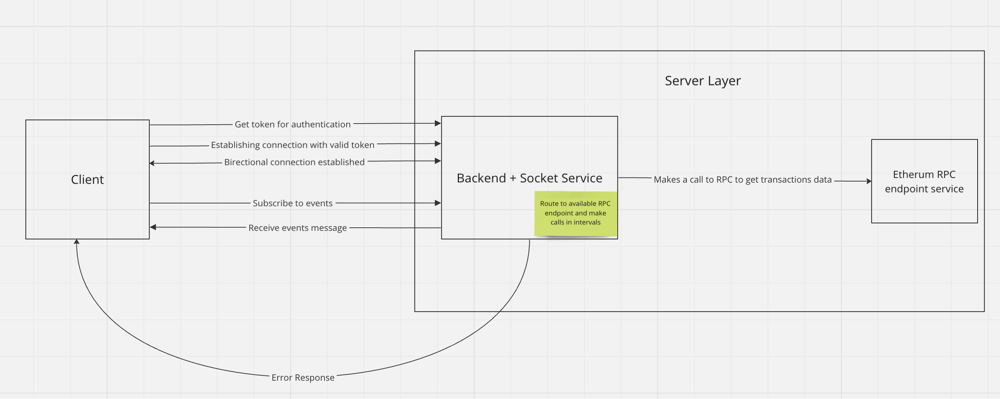

# Ethereum-Tracker

> Track and analyze Ethereum blockchain transactions in real-time.

## High Level Overview



### Project Structure

Overall, the project is designed to be scalable, maintainable and extensible. The use of a modular monolithic architecture that can easily spin off to a micro-service that promotes code organization and separation of concerns.

#### Problem Statement

We want to track the activities on the block for our analysis application by streaming the transactions on the blockchain as they happen. We are interested in the following fields:

- Sender Address
- Receiver Address
- BlockNumber
- BlockHash
- TransactionHash
- Gas Price in `WEI`
- Value in `WEI`

On completion, your API should be a [socket.io](https://socket.io/) endpoint that will allow me to subscribe to events in the following ways:

- All events `all`
- Only events where an address is either the `sender` or `receiver`.
- Only events where an address is the `sender`
- Only events where an address is the `receiver`
- Assume that `1 ETH to $5,000` and send events within the ranges.
  1.  `0-100`
  2.  `100-500`
  3.  `500-2000`
  4.  `2000-5000`
  5.  `&gt; 5000`

We do not want just anyone to access our socket endpoints, so we will need a HTTP endpoint to register and log in. All requests to the [socket.io](https://socket.io/) endpoint will require a **JWT** token.

#### Constraints

1. Handle errors correctly and return useful error messages when there are issues.

2. Use appropriate data structures and algorithms to optimize your solution and minimize resource consumption

3. An **ETH** block is confirmed in _~12 seconds_. Blocks can have up to _~1,500_ transactions in them (but a typically around 500 or less). You should do your best to make sure your API should handle sending this much data.

4. Public Ethereum RPC endpoints may be down from time to time or you may run out of free API calls (_~300_ requests/min). You should pool the connections such that if an RPC is down, you can switch to the next one that is available.

#### Tech Stack

- [Node.js](https://nodejs.org/en/download/package-manager)
- [Express](https://expressjs.com/)
- [TypeScript](https://www.typescriptlang.org/download/)
- [TypeORM](https://typeorm.io/)
- [PostgreSQL](https://www.postgresql.org/)

#### Application Requirements

- Node.js 24 LTS (24.11 or newer) and npm 11. `.nvmrc` and `.node-version` select Node 24.
- [Docker](https://www.docker.com/products/docker-desktop/) with Compose v2 or newer
- [Git](https://git-scm.com/downloads)
- [Postman](https://www.postman.com/downloads/)

#### Environment

Copy `.env.dev` to `.env` and set your database credentials, a strong `JWT_SECRET`, and RPC URLs.

#### Installation 📦

```bash
   $ git clone https://github.com/sheygs/ethereum-tracker.git
   $ cd ethereum-tracker
   $ nvm use
   $ npm ci
```

Use `npm run dev` for local development. This uses Node's built-in watcher and ts-node to compile TypeScript decorators. For a local Postgres connection to the Compose database, set `POSTGRES_HOST=localhost` and `POSTGRES_PORT=5430`.

#### Using Docker (Recommended)

- Start Docker, then run `docker compose up -d --build`.
- Register an account using `/api/v1/auth/signup`, then open `http://localhost:3001` and log in with your email and password.
- Subscribe to transaction events. Unsubscribe stops the selected subscription.

Transaction `value` and `gasPrice` are returned as decimal wei strings to preserve precision. Streaming starts at the latest block on the first poll and catches up sequentially after delays. Pagination applies separately to each subscriber and each block.

Compose is a local development stack: it uses `NODE_ENV=development` so TypeORM creates the schema. The API listens on container port 3000 and host port 3001. Postgres 18 stores its data in the named `postgres-data` volume at `/var/lib/postgresql`; its host port 5430 is bound to localhost. Redis was removed because the application does not use it.

The previous Postgres mount (`./volumes/data:/data/db`) did not persist the database's actual data directory. If an existing container contains data you need, export it with `pg_dump` before replacing the container and restore it into Postgres 18. Do not reuse an older major version's physical data directory. Normal `docker compose down` preserves the new named volume; `docker compose down -v` removes it.

The Docker image runs as a non-root user with production dependencies only. Its default environment is production, where schema synchronization is disabled. For production, provision the schema through reviewed migrations and run `npm run typeorm:run-migrations:prod` before starting the service. Set `POSTGRES_SSL=true` when the database requires TLS. The existing initial migration is a legacy partial schema and should not be used as a complete production bootstrap.

#### Dependencies and TypeScript

`package-lock.json` is the authoritative lockfile; use `npm ci` for reproducible installations. TypeScript 6 is retained because TypeScript 7 is outside the supported ranges of ts-jest and typescript-eslint. The targeted `js-yaml` override upgrades Jest's NYC configuration loader to a compatible patched dependency. Test types are configured separately in `tsconfig.test.json`.

#### Test

- Run `npm test -- --runInBand`.
- Run `npm run build`, `npm run typecheck:tests`, and `npm run eslint`.

#### API Documentation

- Please see `/postman_docs` directory on the root.

#### Demo Link

- [Backend Demo](https://www.loom.com/share/ca53c40bcda3459f905494f5c419d741?sid=0354ca8b-edfb-4eb5-89d6-097526a7b20a)

#### Improvement Points

- Implement caching to store frequently accessed data in a faster storage layer to reduce database load or unnecessary remote api calls.
